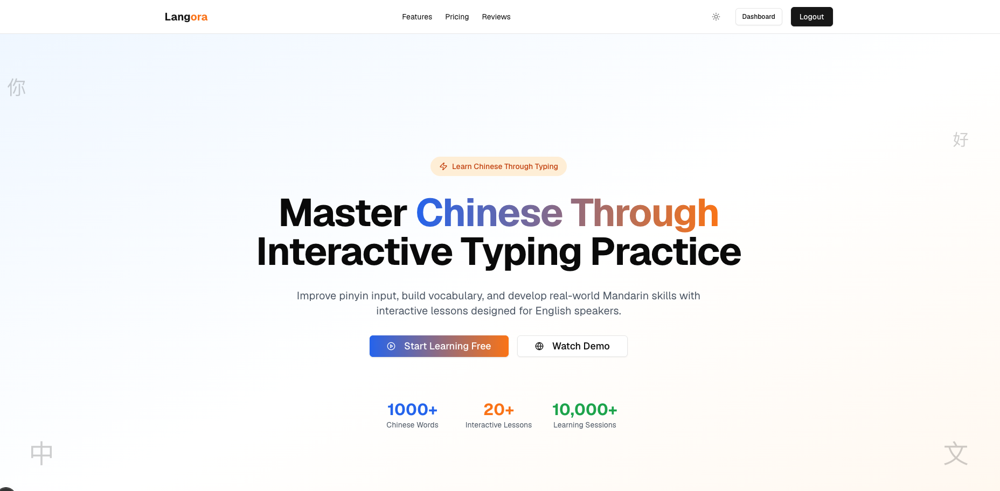
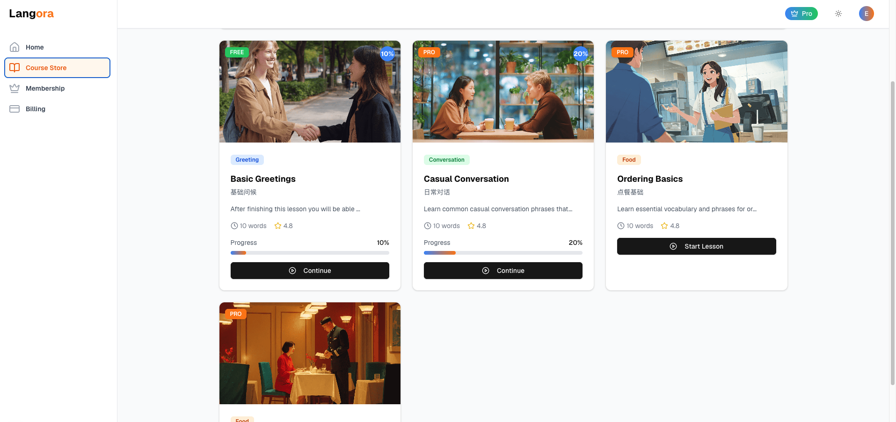
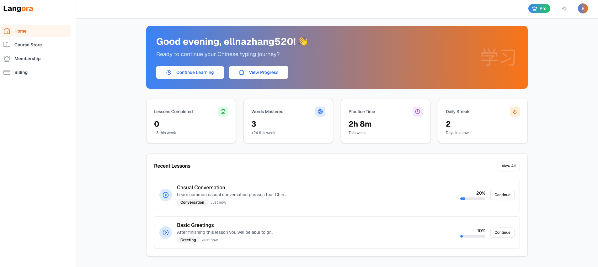
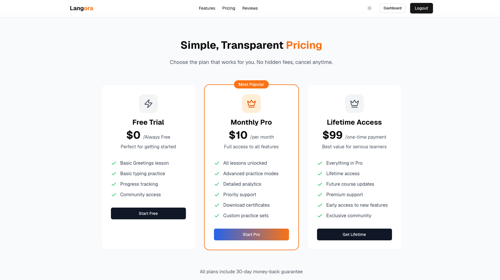
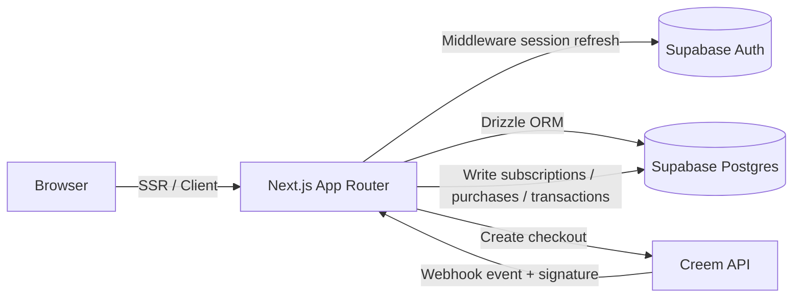

<div align="center">

# Langora

**Learn Chinese the way you learn touch‑typing.**
Read an English prompt, hear the audio, type the **pinyin** — get instant, gamified feedback.

[](https://nextjs.org/)
[](https://react.dev/)
[](https://www.typescriptlang.org/)
[](https://supabase.com/)
[](https://orm.drizzle.team/)
[](https://tailwindcss.com/)
[](./LICENSE)

[中文文档](./README_zh.md) · [Report a bug]([GitHub Repository](https://github.com/KapiYue/Langora)/issues) · [Request a feature]([GitHub Repository](https://github.com/KapiYue/Langora)/issues)
</div>
<p align="center">
  
</p>

## Overview

**Langora** is an interactive practice app for Chinese learners, inspired by TypingClub's "type‑to‑progress" model. Each question shows an English prompt and auto‑plays its audio; the learner types the matching **pinyin**, and the app validates the answer, plays sound effects, and records progress in real time.

Lessons are grouped by theme — Greetings, Casual Conversation, Ordering Food, and more — and the content is monetized through a monthly subscription, a lifetime plan, and single‑lesson purchases.

🔗 Live demo: `[https://langora.joy-codex.com]` · 📦 Repository: `[GitHub Repository](https://github.com/KapiYue/Langora)`

## Screenshots

<table>
  <tr>
    <td width="50%"></td>
    <td width="50%"></td>
  </tr>
  <tr>
    <td align="center"><sub>Course Store — browse lessons by topic and access tier</sub></td>
    <td align="center"><sub>Dashboard — streaks, accuracy, and recent lessons</sub></td>
  </tr>
  <tr>
    <td colspan="2"></td>
  </tr>
  <tr>
    <td colspan="2" align="center"><sub>Simple, transparent pricing — Free, Monthly Pro, and Lifetime</sub></td>
  </tr>
</table>

## Features

### Learning experience
- **Type‑to‑progress drills** — English prompt + auto‑played audio; answer in pinyin with lenient matching (case, tone numbers, and extra spaces are ignored), and multiple accepted answers per question.
- **Immersive feedback** — keystroke, correct, and error sound effects, plus a confetti animation on lesson completion.
- **Keyboard shortcuts** — `Ctrl + P` replays the audio, `Enter` submits an answer or advances to the next question.
- **Progress visualization** — per‑item progress bar, question counter, and live accuracy tracking.

### Authentication
- Email/password sign‑up, login, forgot‑password, and reset flows powered by **Supabase Auth**.
- **Cookie‑based SSR sessions** (`@supabase/ssr`), refreshed centrally through Next.js Middleware.

### Dashboard
- Learning overview: lessons completed, total words mastered, current streak, weekly practice time, and average accuracy.
- Recent lessons, a course store with per‑lesson progress, a profile page, and account settings (password change).

### Content & access control
- Lessons, lesson items, and progress are stored in Postgres and can be imported via a seed script.
- Access rules: the free lesson (`greetings_l1`) is open to everyone; Pro and Lifetime members unlock every lesson; single‑lesson purchases unlock just that lesson.

### Payments & membership (Creem)
- Three tiers: **Free**, **Monthly Pro** ($10/mo), **Lifetime** ($99 one‑time) — plus standalone **single‑lesson** purchases.
- Webhook requests are verified with an **HMAC‑SHA256** signature check (`crypto.timingSafeEqual`) before any data is written.
- **Grace period on cancellation** — a canceled subscription stays active until the end of the current billing cycle; a **refund** revokes access immediately.
- **Upgrade protection** — purchasing Lifetime access automatically cancels an active Monthly Pro subscription to prevent double billing.
- **Duplicate‑purchase guard** — blocks redundant checkouts when the user already owns an equal or higher tier.

## Tech stack

| Area | Technology |
| --- | --- |
| Framework | Next.js 15 (App Router, Turbopack), React 19 |
| Language | TypeScript 5 |
| UI | Tailwind CSS 3, shadcn/ui (Radix UI), Framer Motion, lucide-react |
| Auth | Supabase Auth (`@supabase/ssr`, cookie/SSR) |
| Database | Supabase Postgres + Drizzle ORM (`postgres-js` driver) |
| Migrations | drizzle-kit |
| Payments | Creem (Checkout + Webhook) |
| Misc | use-sound, react-confetti, next-themes |

## Architecture



## Data model

| Table | Purpose |
| --- | --- |
| `lessons` | Lessons (title, description, tag, order, cover image) |
| `lesson_items` | Lesson items (English prompt, Chinese, pinyin, accepted answers, audio) |
| `user_profiles` | Profile and aggregate stats (lessons completed, words mastered, streak) |
| `user_lesson_progress` | Lesson‑level progress (completed items, accuracy, time spent) |
| `user_item_progress` | Item‑level progress (attempts, correct attempts) |
| `user_daily_stats` | Daily learning statistics |
| `user_subscriptions` | Pro / Lifetime subscriptions |
| `user_course_purchases` | Single‑lesson purchases |
| `payment_transactions` | Payment transaction ledger |

## Project structure

```text
app/
  page.tsx                 # Landing page (Hero / Features / Pricing / ...)
  auth/                     # Login / sign-up / password recovery
  dashboard/                # Overview / courses / membership / billing / profile / settings
  lesson/[lessonId]/        # Lesson player (with access control)
  api/
    lesson-progress/        # Save learning progress
    payment/                # checkout / webhook / status / cancel
components/                 # Landing page, dashboard, lesson, and shared UI components
lib/
  supabase/                 # client / server / middleware
  db/                       # schema / queries / seed / connection
  creem.ts                  # Payment config and helpers
  membership/plans.ts       # Plan definitions
drizzle/                    # Migration files
docs/                       # API references, lesson seed data, screenshots
```

## Getting started

### Prerequisites
- Node.js ≥ 20 and pnpm
- A [Supabase](https://supabase.com/) project (Postgres + Auth)
- A [Creem](https://www.creem.io/) account (the test environment is fine)

### 1. Install dependencies

```bash
pnpm install
```

### 2. Configure environment variables

Copy `.env.example` to `.env.local` and fill in the values:

```bash
# Supabase
NEXT_PUBLIC_SUPABASE_URL=
NEXT_PUBLIC_SUPABASE_PUBLISHABLE_OR_ANON_KEY=
DATABASE_URL=

# Site
NEXT_PUBLIC_SITE_URL=http://localhost:3000

# Creem
CREEM_API_KEY=
CREEM_WEBHOOK_SECRET=
NEXT_PUBLIC_CREEM_URL=https://test-api.creem.io
CREEM_LIFETIME_PRODUCT_ID=
CREEM_SUBSCRIPTION_PRODUCT_ID=
CREEM_SINGLE_COURSE_PRODUCT_ID=
```

### 3. Initialize the database

```bash
pnpm db:push     # sync the schema (or db:migrate to apply migrations)
pnpm db:seed     # import lessons from docs/lessons.json
```

### 4. Run the dev server

```bash
pnpm dev
```

Open [http://localhost:3000](http://localhost:3000).

## Available scripts

| Command | Description |
| --- | --- |
| `pnpm dev` | Start the dev server (Turbopack) |
| `pnpm build` / `pnpm start` | Build / run in production |
| `pnpm lint` | Run ESLint |
| `pnpm db:generate` | Generate a new migration |
| `pnpm db:migrate` / `pnpm db:push` | Apply migrations / push schema directly |
| `pnpm db:studio` | Open Drizzle Studio |
| `pnpm db:seed` | Seed lesson data from `docs/lessons.json` |

## Payments notes (Creem)

- Checkout sessions pass `userId`, `paymentType`, and `lessonId` through `metadata`, which the webhook uses to post ledger entries accurately.
- The webhook path (`/api/payment/webhook`) is excluded from the Middleware matcher so the session‑refresh logic never interferes with it, and it verifies its own signature independently.
- Switch between test and production by changing `NEXT_PUBLIC_CREEM_URL` and the three `*_PRODUCT_ID` environment variables.

## Deployment

Recommended stack: **Vercel + Supabase**.

1. Create a Supabase project, then run migrations and seed the lesson data.
2. Set the environment variables above in your Vercel project (`NEXT_PUBLIC_SITE_URL` should point to your live domain).
3. Point the Creem webhook to `https://<your-domain>/api/payment/webhook`.

## Roadmap

- [ ] More lesson themes and difficulty tiers
- [ ] Mistake review / spaced repetition
- [ ] Leaderboards and achievements
- [ ] Mobile UX polish
- [ ] Full UI internationalization (i18n)

## Contributing

Contributions, issues, and feature requests are welcome. Please read [CONTRIBUTING.md](./CONTRIBUTING.md) before opening a pull request, and note that this project follows a [Code of Conduct](./CODE_OF_CONDUCT.md).

## Security

If you discover a security vulnerability, please follow the responsible‑disclosure process described in [SECURITY.md](./SECURITY.md) instead of opening a public issue.

## License

Released under the [MIT License](./LICENSE).
