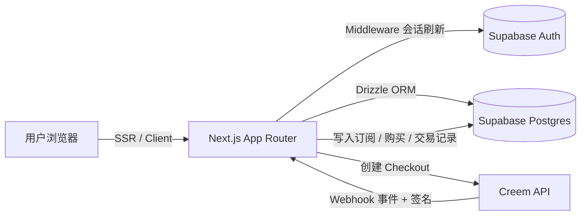

<div align="center">

# Langora

**像练习打字一样学中文。**
看英文提示、听发音、输入**拼音**——即时反馈、闯关式进阶。

[](https://nextjs.org/)
[](https://react.dev/)
[](https://www.typescriptlang.org/)
[](https://supabase.com/)
[](https://orm.drizzle.team/)
[](https://tailwindcss.com/)
[](./LICENSE)

[English](./README.md) · [提交 Bug]([GitHub Repository](https://github.com/KapiYue/Langora)/issues) · [提交功能建议]([GitHub Repository](https://github.com/KapiYue/Langora)/issues)

</div>

<br>

<p align="center">
  
</p>

## 项目简介

**Langora** 是一款面向中文学习者的交互式练习应用，灵感来自 TypingClub 的“输入闯关”模式：每道题展示一个英文提示并自动播放音频，学习者输入对应的**拼音**，系统即时校验、播放音效，并实时记录学习进度。

课程按主题（问候、日常对话、餐厅点餐等）组织，并通过月度订阅、终身会员与单课购买实现内容变现。

🔗 在线演示：`https://langora.joy-codex.com` · 📦 仓库地址：`[GitHub Repository](https://github.com/KapiYue/Langora)`

## 界面预览

<table>
  <tr>
    <td width="50%"></td>
    <td width="50%"></td>
  </tr>
  <tr>
    <td align="center"><sub>课程商店 —— 按主题与权限浏览课程</sub></td>
    <td align="center"><sub>仪表盘 —— 连续打卡、准确率与最近学习</sub></td>
  </tr>
  <tr>
    <td colspan="2"></td>
  </tr>
  <tr>
    <td colspan="2" align="center"><sub>简单透明的定价 —— 免费版、月度 Pro、终身会员</sub></td>
  </tr>
</table>

## 核心功能

### 学习体验
- **拼音输入闯关**：英文提示 + 自动播放音频，输入拼音作答；答案宽松匹配（忽略大小写、声调数字、多余空格），且每题支持多个可接受答案。
- **沉浸式反馈**：打字音效、正确/错误音效，完成课程时播放撒花动效。
- **快捷键**：`Ctrl + P` 重播音频，`Enter` 提交答案 / 进入下一题。
- **进度可视化**：题目进度条、当前题号、实时准确率统计。

### 用户与认证
- 基于 **Supabase Auth** 的邮箱密码注册、登录、忘记密码与重置密码流程。
- **Cookie + SSR 会话**（`@supabase/ssr`），通过 Next.js Middleware 统一刷新。

### 个人中心（Dashboard）
- 学习概览：完成课程数、累计掌握词汇、连续学习天数、本周学习时长、平均准确率。
- 最近学习课程、含进度展示的课程商店、个人资料页与账户设置（修改密码）。

### 内容与权限控制
- 课程、题目与学习进度数据均存储于 Postgres，可通过种子脚本批量导入。
- 访问规则：免费课程（`greetings_l1`）人人可学；Pro / 终身会员解锁全部课程；单课购买仅解锁对应课程。

### 支付与会员体系（Creem）
- 三种方案：**免费版**、**月度 Pro**（$10/月）、**终身会员**（$99 一次性付费），以及独立的**单课购买**。
- Webhook 请求在写入数据前会经过 **HMAC-SHA256** 签名校验（使用 `crypto.timingSafeEqual` 进行时序安全比较）。
- **取消后的宽限期**：取消订阅后权益保留至当前计费周期结束；**退款**则立即收回权限。
- **升级保护机制**：购买终身会员后会自动取消仍在计费中的月度 Pro 订阅，避免重复扣费。
- **重复购买拦截**：当用户已拥有同级或更高权益时，阻止无意义的重复下单。

## 技术栈

| 分类 | 技术 |
| --- | --- |
| 框架 | Next.js 15（App Router, Turbopack）、React 19 |
| 语言 | TypeScript 5 |
| 样式 / UI | Tailwind CSS 3、shadcn/ui（基于 Radix UI）、Framer Motion、lucide-react |
| 认证 | Supabase Auth（`@supabase/ssr`，Cookie / SSR） |
| 数据库 | Supabase Postgres + Drizzle ORM（`postgres-js` 驱动） |
| 数据库迁移 | drizzle-kit |
| 支付 | Creem（Checkout + Webhook） |
| 其他 | use-sound、react-confetti、next-themes |

## 系统架构



## 数据模型

| 表 | 说明 |
| --- | --- |
| `lessons` | 课程（标题、描述、标签、排序、封面图） |
| `lesson_items` | 课程题目（英文提示、中文、拼音、可接受答案、音频） |
| `user_profiles` | 用户档案与汇总统计（完成课程数、掌握词汇数、连续天数） |
| `user_lesson_progress` | 课程级进度（完成题数、准确率、用时） |
| `user_item_progress` | 题目级进度（尝试次数、正确次数） |
| `user_daily_stats` | 每日学习统计 |
| `user_subscriptions` | Pro / 终身会员订阅 |
| `user_course_purchases` | 单课购买记录 |
| `payment_transactions` | 支付交易流水 |

## 目录结构（节选）

```text
app/
  page.tsx                 # 落地页（Hero / Features / Pricing / ...）
  auth/                     # 登录 / 注册 / 找回密码
  dashboard/                # 概览 / 课程 / 会员 / 账单 / 资料 / 设置
  lesson/[lessonId]/        # 课程播放页（含访问控制）
  api/
    lesson-progress/        # 保存学习进度
    payment/                # checkout / webhook / status / cancel
components/                 # 落地页、Dashboard、课程播放、通用 UI 组件
lib/
  supabase/                 # client / server / middleware
  db/                       # schema / queries / seed / 数据库连接
  creem.ts                  # 支付配置与工具函数
  membership/plans.ts       # 套餐定义
drizzle/                    # 数据库迁移文件
docs/                       # API 文档、课程种子数据、界面截图
```

## 本地开发

### 环境要求
- Node.js ≥ 20，以及 pnpm
- 一个 [Supabase](https://supabase.com/) 项目（提供 Postgres + Auth）
- 一个 [Creem](https://www.creem.io/) 账号（测试环境即可）

### 1. 安装依赖

```bash
pnpm install
```

### 2. 配置环境变量

复制 `.env.example` 为 `.env.local` 并填写：

```bash
# Supabase
NEXT_PUBLIC_SUPABASE_URL=
NEXT_PUBLIC_SUPABASE_PUBLISHABLE_OR_ANON_KEY=
DATABASE_URL=

# 站点
NEXT_PUBLIC_SITE_URL=http://localhost:3000

# Creem
CREEM_API_KEY=
CREEM_WEBHOOK_SECRET=
NEXT_PUBLIC_CREEM_URL=https://test-api.creem.io
CREEM_LIFETIME_PRODUCT_ID=
CREEM_SUBSCRIPTION_PRODUCT_ID=
CREEM_SINGLE_COURSE_PRODUCT_ID=
```

### 3. 初始化数据库

```bash
pnpm db:push     # 同步表结构（或使用 db:migrate 应用迁移）
pnpm db:seed     # 从 docs/lessons.json 导入课程数据
```

### 4. 启动开发服务器

```bash
pnpm dev
```

访问 [http://localhost:3000](http://localhost:3000)。

## 常用脚本

| 命令 | 说明 |
| --- | --- |
| `pnpm dev` | 启动开发服务器（Turbopack） |
| `pnpm build` / `pnpm start` | 构建 / 生产环境启动 |
| `pnpm lint` | 运行 ESLint 代码检查 |
| `pnpm db:generate` | 生成新的数据库迁移 |
| `pnpm db:migrate` / `pnpm db:push` | 应用迁移 / 直接推送 schema |
| `pnpm db:studio` | 打开 Drizzle Studio 可视化工具 |
| `pnpm db:seed` | 从 `docs/lessons.json` 导入课程种子数据 |

## 支付集成要点（Creem）

- Checkout 会话通过 `metadata` 回传 `userId`、`paymentType`、`lessonId`，Webhook 据此精准记账。
- Webhook 路径（`/api/payment/webhook`）已从 Middleware 的匹配规则中排除，避免会话刷新逻辑干扰，并独立完成自身的签名校验。
- 通过修改 `NEXT_PUBLIC_CREEM_URL` 以及三个 `*_PRODUCT_ID` 环境变量即可在测试 / 生产环境间切换。

## 部署

推荐使用 **Vercel + Supabase** 组合：

1. 在 Supabase 创建项目，执行数据库迁移并导入课程种子数据。
2. 在 Vercel 项目中配置上述环境变量（`NEXT_PUBLIC_SITE_URL` 需指向线上域名）。
3. 在 Creem 后台将 Webhook 地址指向 `https://<你的域名>/api/payment/webhook`。

## 路线图

- [ ] 更多课程主题与难度分级
- [ ] 错题本 / 间隔复习
- [ ] 排行榜与成就系统
- [ ] 移动端体验优化
- [ ] 完整的界面国际化（i18n）

## 参与贡献

欢迎提交 Issue、功能建议与 Pull Request。提交 PR 前请先阅读 [CONTRIBUTING.md](./CONTRIBUTING.md)，并注意本项目遵循 [行为准则](./CODE_OF_CONDUCT.md)（Code of Conduct）。

## 安全性

如果你发现安全漏洞，请按照 [SECURITY.md](./SECURITY.md) 中描述的负责任披露流程进行报告，而不是直接提交公开 Issue。

## 许可证

本项目基于 [MIT License](./LICENSE) 开源发布。
